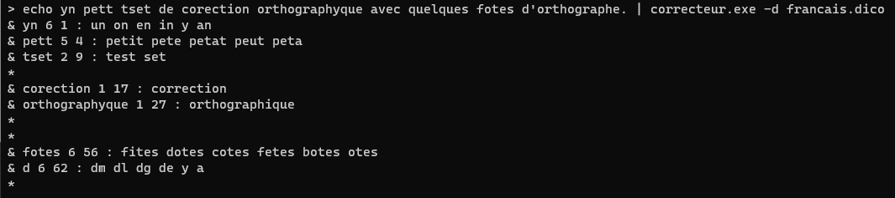

  <strong>Welcome to this C-based Spell-checker using BK-Tree and Levenshtein-Damerau distance.</strong>
   
  

# Installation de CUnit et Doxygen
Taper la commande suivante dans un terminal :
	sudo apt-get install libcunit1 libcunit1-dev libcunit1-doc doxygen

# Utilisation du makefile
Pour la compilation de l'exécutable, des tests et de la documentation :

	make all

Pour la compilation de l'exécutable seul :

	make exe

Pour la compilation des tests seuls :

	make tests

Pour la compilation de la documentation seule :

	make doc

Pour le nettoyage du répertoire :

	make clean

# Dictionnaire de référence
Le dictionnaire de la langue française utilisable par notre correcteur orthographique est généré à partir du fichier dico-ref-ascii.txt.

Pour le remplir avec le dictionnaire français : ./bin/correcteur -d fic.dico -f dico-ref-ascii.txt
